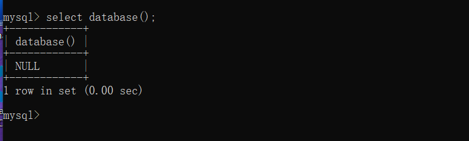
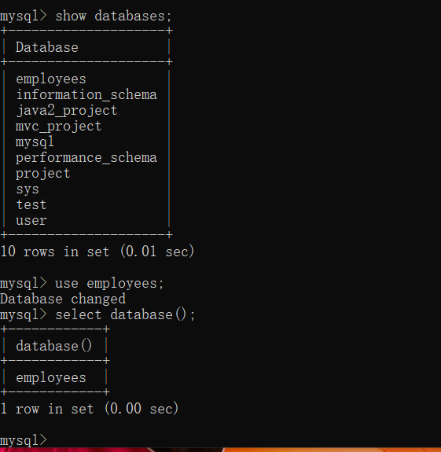
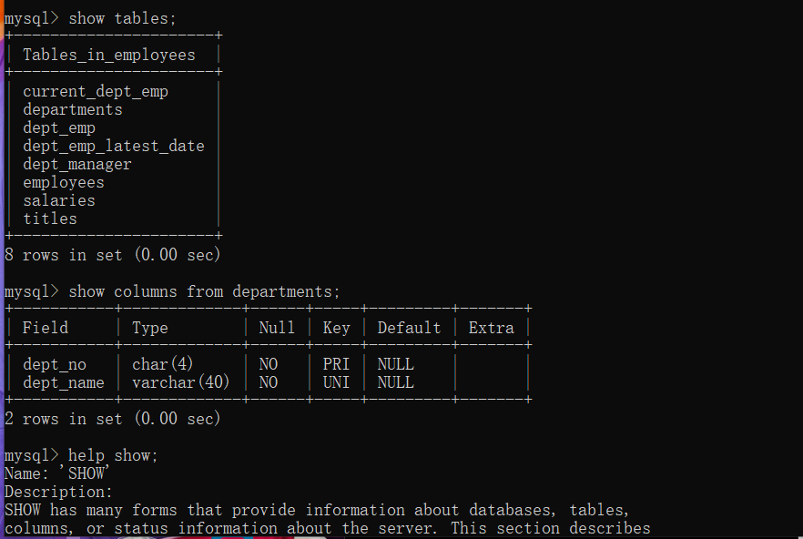

## 登录

第一步我们要在命令行登录mysql

使用指令：

```sql
mysql -h host -u user -p
```

其中host为主机名，如果连接到本地的MySQL服务器，那么就是localhost，如果省略-h host默认为使用本地的MySQL服务器，user表示用户名，输入这一条指令之后MySQL会提示输入密码，密码输入之后就成功登录mysql，之后就可以进行数据库操作了。

## 选择数据库

进入MySQL之后默认是没有选中数据库的



我们可以通过下面的指令显示可用的数据库：

```sql
show databases;
```

通过use指令来使用选中要使用的数据库

```sql
use database_name;
```



之后我们就可以对这个数据库里面的表进行一系列的增删改查的操作了。

如果想要切换数据库，我们可以依然可以通过上面的use指令进行切换，如果我们想要查看选中数据库中的表的信息我们可以通过下面的指令进行操作：

```mysql
show tables; #显示当前数据库中的表名
show columns from tables_name; # 显示某一个表里面的列的信息
help show; # 显示show相关的指令
```



